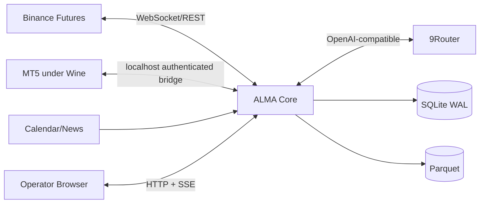
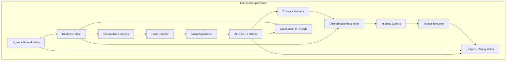

# 03 — Architecture Blueprint

## Prinsip

1. Satu proses aplikasi utama sejauh memungkinkan.
2. Fast path tidak menunggu AI.
3. Venue truth mengalahkan cache dan memory.
4. AI menentukan intent/target; executor mengurus mechanics.
5. Semua perubahan uang dapat direkonstruksi dari ledger.

## Context diagram



## Container diagram



## Runtime paths

### Fast path

```text
market/order/account event
→ normalize + update state
→ update active bars/features
→ evaluate current execution policy
→ submit/cancel/replace when eligible
→ verify venue event
→ append ledger
```

Tidak ada LLM pada jalur ini.

### Thinking path

```text
material hook
→ debounce/coalesce
→ compact snapshot + relevant memory
→ primary model
→ bounded fallback if infrastructure failure
→ schema/state/expiry validation
→ desired target
→ reconcile against fresh venue truth
→ tactical execution policy
```

### Learning path

```text
closed episode
→ compute net outcome and execution quality
→ update calibration buckets
→ candidate pattern
→ replay
→ shadow
→ optional promotion
```

## Components

| Component | Responsibility | Persistent? |
|---|---|---:|
| Ingestor | Normalize venue/news events and timestamps | No |
| State | Current market/account/order truth cache | Snapshot only |
| Features | Incremental bars, volatility, structure, flow | Derived |
| Hooks | Detect material changes and coalesce events | No |
| Brain | Prompt, AI call, fallback, telemetry | Decisions only |
| Validator | Decision Contract and state freshness | Audit result |
| Reconciler | Desired target minus actual/pending state | Intent |
| Guards | Technical validity and venue mode | Veto event |
| Executor | Order lifecycle and adaptive entry envelope | Orders/fills |
| Storage | SQLite ledger + Parquet market events | Yes |
| Dashboard | Read model + authenticated control endpoints | Modes/audit |

## Deployment profile A — single Linux VPS

```text
Ubuntu VPS
├── alma.service
├── 9router.service/process
├── Xvfb or virtual desktop only if MT5 requires it
├── Wine prefix dedicated to MT5
├── terminal64.exe + AlmaBridge.ex5
├── SQLite/Parquet data
└── dashboard bound to 127.0.0.1/private VPN
```

Advantages: one host, loopback bridge, lower operational count.  
Risks: Wine/GUI lifecycle, broker compatibility, terminal update behavior. Mitigated by watchdog, auto-login session, dedicated Wine prefix, and soak tests.

## Deployment profile B — MT5 fallback host

```text
Linux VPS: ALMA + 9Router + storage + dashboard
Windows VPS: MT5 + AlmaBridge EA
Private VPN: authenticated bridge traffic
```

Only used if profile A fails reliability gates. Business logic remains on Linux.

## Failure behavior

| Failure | Behavior |
|---|---|
| AI timeout/quota/5xx | bounded retry/fallback; no target if exhausted |
| 9Router unavailable | no new target; active venue protection remains |
| Binance disconnect | stop new exposure, reconnect, resync |
| MT5/Wine disconnect | stop MT5 exposure changes, restart terminal, resync |
| SQLite busy | bounded local retry; money event not acknowledged before durable append |
| stale market/account state | freeze new exposure |
| process crash | systemd restart; recover modes/intents; query venue truth |
| dashboard disconnect | bot continues; no trading dependency on UI |

## Technology decisions

- **Python 3.12 + NautilusTrader 1.230.0:** event engine and Binance adapter.
- **aiohttp:** 9Router client, MT5 bridge, dashboard, SSE.
- **SQLite stdlib:** ledger/config/memory; WAL mode.
- **PyArrow/Parquet through Nautilus dependency:** replay market data.
- **Static HTML/CSS/JS:** dashboard; no frontend build chain initially.
- **MQL5 EA:** minimal MT5 sensor/executor.
- **systemd:** lifecycle, restart, limits, environment.

## Repository destination

```text
alma/
├── docs/blueprint/       # these six documents
├── pyproject.toml
├── uv.lock
├── src/alma/
├── static/index.html
├── mt5/AlmaBridge.mq5
├── tests/
└── deploy/systemd/
```

Create only files required by the active milestone; this is the destination map, not mandatory scaffolding.
